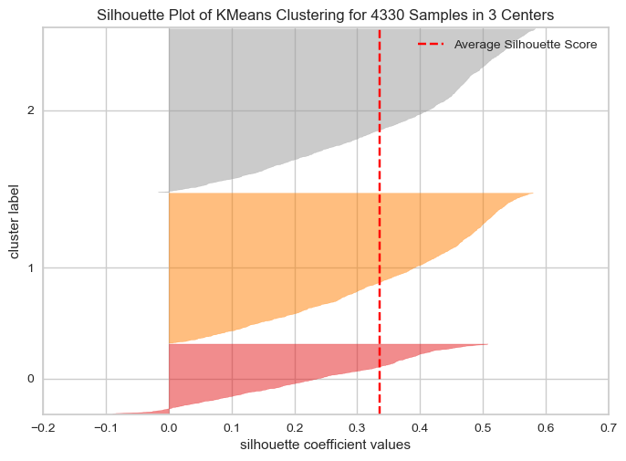

# Modelo de análise das métricas RFM

## Introdução
Uma empresa de e-commerce está buscando entender melhor o comportamento de seus clientes para personalizar as suas campanhas de marketing. Para isso, ela disponibilizou uma base de dados em csv contendo informações a sobre os clientes, produtos e transações realizadas entre os anos de 2010 e 2011.

## Objetivo do projeto

A partir da base de dados disponibilizada, o presente projeto tem como objetivo desenvolver um modelo de machine learning de Clusterização que permita analisar as métricas RFM destes clientes, agrupando-os os em clusters com base em seu comportamento de compra, identificando padrões e características comuns dentro destes grupos.

A partir disso, ainda é necessário explicar de que forma esta análise pode ser útil para a empresa, no intuito de segmentar seus clientes e personalizar campanhas de marketing, sugerindo ações possíveis para cada um dos grupos identificados.

## Sobre os dados

Os dados fornecidos possuem informações de transações de compras da empresa realizada em 38 países diferentes, com mais de 4.000 clientes únicos e mais de 540.000 transações.

Segue abaixo um descritivo do significado das informações presentes em cada coluna do dataset.

- InvoiceNo: Identificação da transação;
- StockCode: Código de estoque do produto;
- Description: Descrição do produto;
- Quantity: Quantidade de produtos por transação;
- InvoiceDate: Data da transação;
- UnitPrice: Preço unitário do produto;
- CustomerID: Identificação do cliente;
- Country: País de origem da transação.

## Bibliotecas utilizadas

Segue uma lista com as bibliotecas em Python utilizadas no desenvolvimento e resolução deste case.

- pandas
- numpy
- plotly
- matplotlib
- scikit-learn
- yellowbrick

## Deployment

Este projeto foi todo desenvolvido utilizando o VS CODE. Portanto, se torna necessário a instalação deste ou de algum outro interpretador de código para o seu correto funcionamento. Em seguida, foram instaladas as extensões do Python e Jupyter Notebook dentro do VS CODE.

OBS: Versão do Python utilizada no projeto = 3.11.5

### Instalação das bibliotecas utilizadas

Feita as instalações dos requisitos base acima, agora é necessário instalar as bibliotecas, listadas no arquivo 'requirements.txt', que foram utilizadas no desenvolvimento do projeto. Para isso, executa-se no terminal do VS CODE, o comando abaixo.

```bash

pip install -r requirements.txt

```

## Modelling

O modelo de machine learning definido para este projeto de Clusterização será o KMeans. Como ainda não se sabe a quantidade ideal de grupos de clientes a serem definidos, utiliza-se o gráfico abaixo do 'método do cotovelo' para avaliar a quantidade de clusters em função da variância dos resultados.

- Gráfico da variância em função da quantidade de clusters:


Pelo resultado acima, a quantidade ideal de clusters seria em torno de 5 grupos. Avaliando agora o comportamento das métricas de Silhouette, Davies Bouldin e Calinski Harabasz conforme a variação do número de clusters.

- Tabela de score das métricas de Silhouette, Davies Bouldin e Calinski Harabasz


Avaliando os resultados das métricas acima, optou-se por adotar um número de clusters igual a 3. Pois, para um k=3, tem-se o segundo melhor valor de silhouette_score, a métrica davies_bouldin_score apresenta um resultado mais baixo que os demais 5 primeiros k (o que é um bom sinal visto que quanto menor o valor desta métrica melhor será a clusterização) e também tem o segundo melhor valor de calinski_harabasz_score.

Além disso, para valores de k acima de 3, a própria interpretabilidade dos resultados ficaria mais dispersa, seria mais difícil encontrar padrões claros que justifiquem dividir os clientes de 3 grupos.

Afim de visualizar os scores de silhouette para cada um dos 3 grupos, plotou-se o gráfico abaixo.



O grupo 2 é o que apresenta valores menores de silhouette score, mas no geral todos os 3 grupos tem resultados muito parecidos, não havendo grande discrepância entre um e outro.

Para analisar os 3 em separados, de forma mais clara, é exibida a figura abaixo, onde cada um dos gráficos representa os índices de Recência (R), Frequência (F) e Ticket Médio (M) para cada um dos clusters calculados anteriormente pelo modelo definido KMeans.


## Interpretação dos clusters e planos de ação

Avaliando os gráficos acima, o "cluster 1" apresenta o maior índice de Recência e a menor Frequência dentre os 3 grupos. Se trata portanto de um cluster de clientes que compraram pouquíssimos produtos no e-commerce e não realizam compra nenhuma há um bom tempo nesta empresa. Poderíamos classificá-los portanto como clientes "churn".

Já no "cluster 2" tem-se o menor valor de Recência dentre todos os grupos calculados, indicando que se tratam de clientes que realizaram as suas compras a pouquíssimo tempo. Este grupo ainda tem a maior frequência, o que indica que são clientes que compram a bastante tempo neste e-commerce e com um ticket médio relativamente bom.

Por último o "cluster 3" com Recência relativamente baixa, mas com Frequência também baixa e o ticket médio mais baixo dentre os 3 grupos. No todo, poderíamos classificá-los como clientes que compram pouco a pouco tempo e somente produtos mais baratos. Pode-se concluir portanto que se trata de um grupo de clientes mais novos.

Por fim, deixo como sugestão para a empresa alguns pontos de ação voltados para cada um dos grupos avaliados:

- "Cluster 1": esse é o grupo de alerta, famosos clientes "churn". Uma abordagem interessante talvez seja disparar e-mails de novas promoções, produtos, para tentar de alguma forma resgatar estes clientes. Outro ponto importante seria tentar entender o porquê eles pararam de comprar no e-commerce, talvez realizar um estudo de avaliação dos produtos, de forma a separar os que tiveram pior rating médio dentro deste grupo de clientes.

- "Cluster 2": poderia ser denominado também de "Grupo VIP" ou "Fidelidade", algo neste sentido, pois se tratam dos clientes que mais compram no e-commerce. Para este grupo, seria importante oferecer benefícios, cartões fidelidade, pontos de vantagem, acesso a descontos exclusivos de forma a fidelizá-los ainda mais, aumentando ainda o ticket médio geral do grupo e não correr risco de perdê-los para possíveis concorrentes.

- "Cluster 3": este é o grupo de clientes novos na plataforma, compraram pouco e com um investimento mais modesto. Seria interessante para este caso talvez desenvolver um algoritmo de recomendação para entender melhor quais as preferências de produtos destes clientes, de forma a incetivá-los a continuar comprando neste e-commerce.